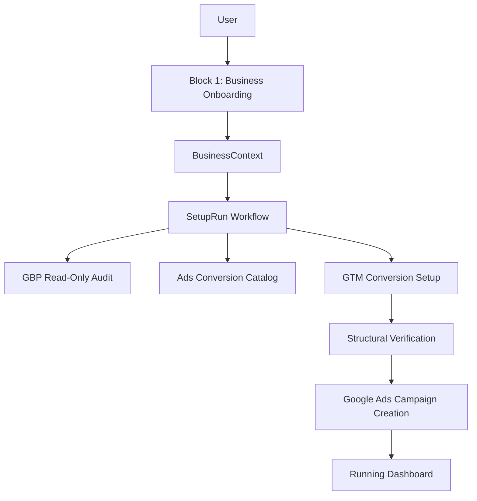

# Zuggernaut V1 Implementation Plan

## Objective
Create a new implementation guide at `docs/v1-implementation-plan.md` that can be used as the step-by-step build manual for Zuggernaut V1. The document will align with the finalized architecture in `docs/architecture_review.md` and translate it into Composer-friendly implementation phases.

V1 product outcome:
- First-time user onboarding captures and confirms business requirements.
- GBP is connected for read-only audit.
- GTM is connected and configured for conversion tracking.
- Google Ads is connected and campaigns are automatically created after verification.
- The system is built around durable orchestration, idempotency, and provider-safe execution.

## Source Material To Use
- `docs/architecture_review.md` as the authoritative architecture source.
- Existing scraper and business intelligence logic in `backend/services/scraper.js` and related scrape routes.
- Existing Google Ads and OAuth code paths in `backend/api/routes/oauthRoutes.js`, `backend/api/routes/googleAds.js`, and `backend/api/routes/campaigns.js` as migration/reference material.
- Existing frontend onboarding/demo patterns in `frontend/src/demo/steps/DemoStep0.jsx` and `frontend/src/demo/DemoWizard.jsx`.
- Current tool stack from `backend/package.json` and `frontend/package.json`.

## Finalized MVP Tooling
- Frontend: React + Vite, hosted on Firebase Hosting.
- Backend API: Node.js + Express, hosted on Railway.
- Database: MongoDB Atlas using Mongoose.
- Workflow orchestration: Temporal.
- Logging: Pino JSON logs to stdout, consumed initially by Railway logs.
- Workflow observability: Temporal UI.
- Runtime observability: Railway metrics/logs for MVP; OpenTelemetry/Grafana deferred unless needed.
- Google APIs: official Google API clients and existing `google-ads-api` dependency where appropriate.

## Product Blocks
The implementation guide will define reusable product blocks so future channels can plug into the same pattern.

### Block 1: First-Time Business Onboarding
This block happens once after registration and becomes the foundation for every current and future marketing module.

Steps:
- Login / registration.
- Website URL capture.
- Scrape business website.
- Extract business name, industry, services, service areas, contact methods, audience signals, goals, differentiators, and order value where available.
- User confirms and edits the final `BusinessContext`.
- Store confirmed business context separately from raw scrape output.

Output:
- `BusinessContext` is the canonical business input for all later blocks.

### Block 2: Google Ads Setup Module (V1 Channel Block)
This is the first channel block to build.

First-time setup layer:
- Connect Google Ads.
- Fetch conversion catalog.
- Connect GTM.
- Create conversion tracking configuration.
- Connect/read GBP audit where available.
- Create initial Google Ads campaigns after structural verification.

Repeated-use layer, deferred but model-aware:
- Return to change configuration.
- Monitor campaign status/performance.
- Optimization layer for budget, bidding, targeting, and ads.

## Core Architecture Flow
The implementation guide will include this flow:

## Implementation Phases

### Phase 0: Architecture and Repo Preparation
Purpose: establish the target structure before feature work starts.

Instructions:
- Keep existing implementation as reference material.
- Do not rewrite everything at once.
- Add the new V1 architecture alongside existing routes/services where possible, then migrate behavior gradually.
- Define the folder layout for API, workflows, activities, services, models, configs, and workers.

Recommended backend structure:
- `backend/api/v1/` for versioned public API routes.
- `backend/workflows/` for Temporal workflows.
- `backend/activities/` for Temporal activities.
- `backend/services/capabilities/` for GBP, GTM, Ads capability services.
- `backend/models/` for Mongoose models.
- `backend/config/rules/` for versioned campaign, conversion, and GTM trigger configs.
- `backend/lib/observability/` for logger setup.
- `backend/workers/` for Temporal worker bootstraps.

### Phase 1: Foundational Models
Purpose: introduce enterprise-grade persistence before provider integrations.

Models to add or adapt:
- `BusinessContext`
- `SetupRun`
- `SetupStepExecution`
- `IntegrationConnection`
- `IntegrationArtifact`
- `AuditReport`

Key rules:
- Every model must include `businessId` for tenant isolation.
- `SetupRun` is the source of truth for workflow state.
- `IntegrationArtifact` is the source of truth for external resources.
- Raw scrape output must not overwrite confirmed user context.

### Phase 2: Logging and Minimal Observability
Purpose: add enough MVP observability without overbuilding.

Instructions:
- Add Pino for structured logging.
- Every log related to setup must include `setupRunId`, `businessId`, `stepName`, and `provider` where available.
- Use Temporal UI for workflow-level visibility.
- Use Railway logs and metrics initially.
- Defer OpenTelemetry, Prometheus, Grafana, and custom ops dashboards unless production need proves them necessary.

### Phase 3: Temporal Foundation
Purpose: replace route-driven orchestration with durable workflow orchestration.

Instructions:
- Add Temporal SDK and local development setup.
- Define a `SetupRunWorkflow` that controls the V1 flow.
- Define activities for GBP audit, Ads conversion catalog fetch, GTM setup, verification, and Ads campaign creation.
- Workflows should orchestrate only; external API calls should happen in activities.
- Configure retries and timeouts per activity.
- Persist state transitions back to MongoDB.

Initial workflow states:
- `USER_INPUT_COLLECTED`
- `GBP_CONNECTED`
- `GBP_AUDIT_COMPLETE`
- `GTM_CONNECTED`
- `ADS_CONNECTED`
- `CONVERSION_CATALOG_READY`
- `GTM_SETUP_COMPLETE`
- `GTM_SNIPPET_PENDING`
- `STRUCTURAL_VERIFIED`
- `SETUP_NEEDS_TRACKING_FIX`
- `ADS_CAMPAIGNS_CREATED`
- `RUNNING`
- `FAILED`

### Phase 4: Business Onboarding APIs and UI
Purpose: build Block 1 as the reusable business requirements layer.

Backend instructions:
- Create versioned APIs for starting onboarding, submitting a website URL, saving confirmed business context, and starting setup.
- Reuse scraper logic from `backend/services/scraper.js`, but normalize the result into `BusinessContext`.
- Preserve fallback manual entry when scrape fails.

Frontend instructions:
- Use the existing demo flow patterns from `frontend/src/demo/steps/DemoStep0.jsx`.
- Split UI into first-time onboarding screens: URL input, scraped details review, business goals, audience/service areas/order value, and confirmation.
- Save confirmed business context before any Google setup begins.

### Phase 5: Integration Connection Layer
Purpose: support Google OAuth in a reusable provider model.

Instructions:
- Create `IntegrationConnection` as the durable storage for GBP, GTM, and Google Ads tokens.
- Migrate existing OAuth logic from `backend/api/routes/oauthRoutes.js` into provider-specific connection flows.
- Store scopes, expiry, provider account identifiers, connection health, and timestamps.
- Add proactive refresh behavior before tokens expire.
- Validate scopes at connection time.

MVP security:
- Use encryption for refresh tokens.
- Do not expose tokens to frontend.
- Surface connection health in setup status.

### Phase 6: GBP Audit Capability
Purpose: provide V1 read-only GBP value without taking on modification risk.

Instructions:
- Build `GBPReadOnlyAuditService`.
- Fetch available profile fields through GBP APIs.
- Compare GBP data against confirmed `BusinessContext`.
- Generate `AuditReport` with present, missing, and needs-attention fields.
- Do not modify GBP in V1.

### Phase 7: Ads Conversion Catalog Capability
Purpose: prepare conversion actions for GTM and Ads automation.

Instructions:
- Build `AdsConversionCatalogService`.
- Fetch conversion actions from Google Ads after Ads connection.
- Normalize conversion actions into logical categories: calls, forms, both.
- For primary goal `Both`, deterministically select one call conversion and one form conversion where available.
- Persist selection in `IntegrationArtifact` or conversion catalog output snapshot.

### Phase 8: GTM Conversion Setup Capability
Purpose: automate conversion tracking setup.

Instructions:
- Build `GTMConversionSetupService`.
- Use the selected conversion catalog.
- Create tags and triggers from versioned templates.
- Publish GTM container version.
- Store all GTM resource IDs in `IntegrationArtifact`.
- Ensure every create operation checks for an existing artifact first.

V1 trigger templates:
- Form confirmation page URL trigger.
- Form submit click trigger.
- Call `tel:` click trigger.
- Call element hint click trigger.

### Phase 9: GTM Snippet Setup-Pending and Verification
Purpose: handle the manual website step without losing users.

Instructions:
- Provide clear GTM snippet installation instructions in the UI.
- Add a `GTM_SNIPPET_PENDING` or `SETUP_PENDING` state.
- Implement lightweight presence check where feasible by fetching the website HTML and searching for the GTM container ID.
- Structural verification requires published GTM version, expected tags, expected triggers, linked tag-trigger relationships, and Ads conversion identifiers.
- If verification fails, move to `SETUP_NEEDS_TRACKING_FIX` and show user-friendly next steps.

### Phase 10: Google Ads Campaign Creation Capability
Purpose: deliver the core V1 outcome.

Instructions:
- Build `AdsAutoCampaignService`.
- Use confirmed `BusinessContext` and selected conversions.
- Start with a simple deterministic campaign structure.
- Avoid complex optimization logic in V1.
- Store campaign, ad group, ad, and conversion mapping IDs in `IntegrationArtifact`.
- Campaign creation only runs after structural verification passes.

### Phase 11: Reporting Dashboard
Purpose: show the customer the setup result.

V1 dashboard should show:
- GBP audit summary.
- GTM setup status and verification status.
- Google Ads campaign creation status.
- SetupRun progress and stuck-state instructions.

Do not build a full optimization dashboard in V1.

### Phase 12: Reliability and Guardrails
Purpose: make the MVP safe enough for real customers.

Instructions:
- Add idempotency keys for every provider-changing activity.
- Add artifact lookup before every external create.
- Add retry policies and activity timeouts in Temporal.
- Add simple provider-level rate limiting in workers.
- Add compensation behavior for partial failures, such as pausing Ads campaigns or cleaning up GTM resources where supported.
- Add support states for failed or stuck runs.

### Phase 13: Testing
Purpose: avoid regression in orchestration and external API behavior.

Testing layers:
- Unit tests for state transitions, config selection, idempotency keys, and verification logic.
- Integration tests with mocked Google API responses.
- Sandbox/manual E2E tests for a full SetupRun before any real customers.

### Phase 14: Deployment
Purpose: deploy safely without overbuilding infra.

Instructions:
- Deploy frontend to Firebase Hosting.
- Deploy backend API to Railway.
- Deploy Temporal workers to Railway or the same hosting strategy, separated from API process.
- Use MongoDB Atlas for persistence.
- Use Temporal Cloud for simplest MVP operations if budget allows; otherwise use local/self-hosted only for development and revisit production hosting before launch.

## What To Defer Explicitly
Do not implement these in V1:
- GBP write operations.
- Automated GTM snippet installation.
- GA4 deep integration.
- SEO module.
- Website builder.
- Meta Ads, LinkedIn Ads, Instagram Ads.
- Automated optimization engine.
- Full Prometheus/Grafana/OpenTelemetry stack.
- Custom ops dashboard beyond what Temporal UI and logs provide.

## Definition of Done For V1
V1 is done when:
- A new user can register/login and complete business onboarding.
- Confirmed `BusinessContext` is stored.
- The user can connect required Google integrations.
- A `SetupRun` is created and executed by Temporal.
- GBP audit is generated read-only.
- Google Ads conversion catalog is fetched and selected.
- GTM conversion tracking is configured and structurally verified.
- Google Ads campaigns are created automatically after verification.
- The dashboard shows GBP audit, GTM status, Ads campaign status, and stuck-state recovery instructions.
- Retries do not duplicate external GTM or Ads resources.

## Implementation Discipline For Cursor Composer
Use small, isolated implementation tasks:
- One model at a time.
- One workflow or activity at a time.
- One capability service at a time.
- One frontend screen at a time.
- Add tests immediately for orchestration and idempotency-sensitive code.
- Do not mix provider integrations into route handlers.
- Do not add V2 modules while V1 setup flow is incomplete.