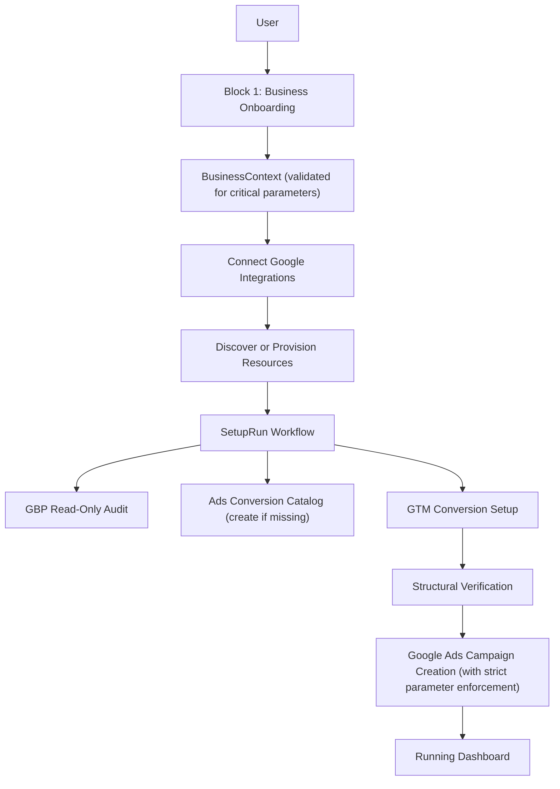

# Zuggernaut V1 Implementation Plan

## Objective
Create a new implementation guide at `docs/v1-implementation-plan.md` that can be used as the step-by-step build manual for Zuggernaut V1. The document will align with the finalized architecture in `docs/architecture_review.md` and translate it into Composer-friendly implementation phases.

V1 product outcome:
- First-time user onboarding captures and confirms business requirements.
- Google integrations are connected with explicit user consent and provider-safe access.
- Google Ads is managed through Zuggernaut's MCC-backed Google Ads API model where available, **with strict enforcement of critical campaign parameters.**
- GTM is provisioned or selected through the user's OAuth grant; if missing, Zuggernaut can create a GTM account/container with explicit permission.
- GBP remains read-only in V1: audit available profile data and show missing information; do not create or modify GBP resources.
- GTM conversion tracking is configured and verified before Ads campaign creation.
- Google Ads campaigns are automatically created after tracking verification.
- The system is built around durable orchestration, explicit consent, idempotency, and provider-safe execution.

## Source Material To Use
- `docs/architecture_review.md` as the authoritative architecture source.
- Existing scraper and business intelligence logic in `backend/services/scraper.js` and related scrape routes.
- Existing Google Ads and OAuth code paths in `backend/api/routes/oauthRoutes.js`, `backend/api/routes/googleAds.js`, and `backend/api/routes/campaigns.js` as migration/reference material.
- Existing frontend onboarding/demo patterns in `frontend/src/demo/steps/DemoStep0.jsx` and `frontend/src/demo/DemoWizard.jsx`.
- Current tool stack from `backend/package.json` and `frontend/package.json`.

## Finalized MVP Tooling
- Frontend: React + Vite, hosted on Firebase Hosting.
- Backend API: Node.js + Express, hosted on Railway.
- Database: MongoDB Atlas using Mongoose.
- Workflow orchestration: Temporal.
- Logging: Pino JSON logs to stdout, consumed initially by Railway logs.
- Workflow observability: Temporal UI.
- Runtime observability: Railway metrics/logs for MVP; OpenTelemetry/Grafana deferred unless needed.
- Google APIs: official Google API clients and existing `google-ads-api` dependency where appropriate.
- Google Ads: MCC-backed customer discovery/provisioning via Google Ads API (`GOOGLE_ADS_DEVELOPER_TOKEN`, `GOOGLE_ADS_LOGIN_CUSTOMER_ID`).
- GTM: Tag Manager API v2 for account/container discovery and creation (`tagmanager.edit.containers`, `tagmanager.publish` scopes).
- GBP: Business Profile APIs for read-only audit only (no write/provisioning in V1).

## Product Blocks
The implementation guide will define reusable product blocks so future channels can plug into the same pattern.

### Block 1: First-Time Business Onboarding
This block happens once after registration and becomes the foundation for every current and future marketing module.

Steps:
- Login / registration.
- Website URL capture.
- Scrape business website.
- Extract business name, industry, services, service areas, contact methods, audience signals, goals, differentiators, and order value where available.
- User confirms and edits the final `BusinessContext`.
- Store confirmed business context separately from raw scrape output.

Output:
- `BusinessContext` is the canonical business input for all later blocks, **and must contain all parameters required for Google Ads campaign creation as per the prioritized list.**

### Block 2: Google Ads Setup Module (V1 Channel Block)
This is the first channel block to build.

First-time setup layer:
- **Pre-requisites for Workflow Progression:**
    - The `BusinessContext` must be clear and complete with all necessary data for campaign creation.
    - A valid and healthy Google Ads connection must be established and verified.
- Connect Google Ads with OAuth and MCC-backed Google Ads API access.
- Discover or provision a Google Ads customer account through the MCC flow where allowed.
- Connect GTM with OAuth per client.
- Discover existing GTM account/container/workspace; if missing, request explicit user permission and create GTM account + web container via Tag Manager API.
- Connect/read GBP where available for audit only.
- If GBP is missing, show missing-profile guidance; do not create or mutate GBP in V1.
- Fetch or create required conversion actions in Google Ads.
- Create GTM conversion tracking configuration.
- **Create initial Google Ads campaigns after structural verification, strictly enforcing parameters from the Core Campaign Definition & Strategy, Ad Group Structure & Ad Creative, and Core Targeting & Conversion Goal Linking buckets.**
- The workflow will not proceed if any critical parameters are missing or invalid.

Repeated-use layer, deferred but model-aware:
- Return to change configuration.
- Monitor campaign status/performance.
- Optimization layer for budget, bidding, targeting, and ads.

## Core Architecture Flow
The implementation guide will include this flow:

```mermaid
flowchart TD
  user["User"] --> onboarding["Block 1: Business Onboarding"]
  onboarding --> businessContext["BusinessContext (validated for critical parameters)"]
  businessContext --> connect["Connect Google Integrations"]
  connect --> discover["Discover or Provision Resources"]
  discover --> setupRun["SetupRun Workflow"]
  setupRun --> gbpAudit["GBP Read-Only Audit"]
  setupRun --> adsCatalog["Ads Conversion Catalog (create if missing)"]
  setupRun --> gtmSetup["GTM Conversion Setup"]
  gtmSetup --> verification["Structural Verification"]
  verification --> adsCreate["Google Ads Campaign Creation (with strict parameter enforcement)"]
  adsCreate --> running["Running Dashboard"]
```

## Database Architecture Strategy

MongoDB collections are defined with Mongoose in `backend/models/`. The goal is **clear separation**: who the user/business is, how orchestration progresses, how we authenticate to Google tools, what we **read** from providers, what we **create or select**, what we **conclude**, and what we **plan** before mutating Ads.

### Mental model

| Concern                                          | Model(s)              |
|--------------------------------------------------|-----------------------|
| Identity                                         | `User`                |
| Canonical business inputs (confirmed by user)    | `BusinessContext`     |
| Workflow run state (Temporal + dashboard)        | `SetupRun`, `SetupStepExecution` |
| OAuth and connection health per integration      | `IntegrationConnection` |
| Read-only payloads fetched from providers (audit, catalogs, snapshots) | `ProviderSnapshot`    |
| Resources **created or selected** in external systems (ids for idempotent retries) | `IntegrationArtifact` |
| GBP audit conclusions vs `BusinessContext`       | `AuditReport`         |
| Intended Google Ads structure **before** create | `CampaignPlan`        |

### Core models (V1)

- **`User`**: Authentication identity (e.g. email, linking to OAuth subject). References `businessId` or primary `BusinessContext` as product design dictates.
- **`BusinessContext`**: Single source of truth for **confirmed** business fields after onboarding/edits; never overwritten by raw scrape output without user confirmation (`businessId`). **Must contain all parameters required for Google Ads campaign creation as per the prioritized list.**
- **`SetupRun`**: One record per orchestrated setup attempt; ties to Temporal workflow id/state; aggregates status for UI (`businessId`).
- **`SetupStepExecution`**: One record per logical step inside a run (GBP audit, catalog fetch, GTM setup, verification, campaign creation); tracks status, errors, retries (`setupRunId`, `businessId`, `provider`, `stepName`).
- **`IntegrationConnection`**: Per provider (GBP / GTM / Google Ads)—tokens, expiry, scopes, provider account identifiers; **encrypt at rest**, never expose tokens to frontend; selective `select:false` fields.
- **`ProviderSnapshot`**: Immutable or versioned payloads **fetched** from APIs (e.g. GBP profile read snapshot, Ads conversion catalog snapshot, optional GTM container version snapshot)—not used as the registry of created resource ids.
- **`IntegrationArtifact`**: Registry of external resources **created or explicitly selected**—e.g. GTM tag/trigger/container ids, Google Ads campaign/ad group/conversion mapping ids. Use consistent enums for `provider` and `artifactType`; store stable provider ids in **`externalId`** (preferred name over a generic “artifact id” to avoid confusion across tools).
- **`AuditReport`**: Structured findings for GBP audit (present / missing / needs attention vs confirmed `BusinessContext`).
- **`CampaignPlan`**: Deterministic intention for Ads (structure, goals, geography, bidding intent) persisted **before** creation; deployed resource ids ultimately land on `IntegrationArtifact`.

### Tenant and workflow rules

- Every tenant-scoped document includes **`businessId`** for isolation and indexing.
- **`SetupRun`** is the backbone for workflow-visible state in MongoDB (Temporal holds execution; Mongo holds durable summaries for API/dashboard).
- **`IntegrationArtifact`** is the source of truth for **external resource ids** and supports **idempotent** activities (“find by `setupRunId` + `provider` + `artifactType` + stable logical identity” (`externalId` / idempotency keys)). Duplicate external creates on retry are unacceptable in V1.
- Raw scrape output must never overwrite **`BusinessContext`** without user confirmation.

### Implementation notes

- Prefer **`backend/constants/`** (or similar) for `provider`, `SetupRun` status enums, `artifactType` values—avoid string drift.
- Mongoose **`timestamps: true`** where appropriate; indexes on **`businessId`**, and compound indexes such as **`(setupRunId, stepName)`** where queries demand it.

## Implementation Phases

**V1 status (2026-07-28):** Phases **0–14** are **COMPLETE** in code (APIs, workflows, capabilities, UI, tests, deploy runbook/configs). Optional live Google real-mode sandbox E2E and live cloud account provisioning remain operator actions outside the repo.

### Phase 0: Architecture and Repo Preparation — **COMPLETE**
Purpose: establish the target structure before feature work starts.

Instructions:
- Keep existing implementation as reference material.
- Do not rewrite everything at once.
- Add the new V1 architecture alongside existing routes/services where possible, then migrate behavior gradually.
- Define the folder layout for API, workflows, activities, services, models, configs, and workers.

Recommended backend structure:
- `backend/api/v1/` for versioned public API routes.
- `backend/workflows/` for Temporal workflows.
- `backend/activities/` for Temporal activities.
- `backend/services/capabilities/` for GBP, GTM, Ads capability services.
- `backend/models/` for Mongoose models.
- `backend/config/rules/` for versioned campaign, conversion, and GTM trigger configs.
- `backend/lib/observability/` for logger setup.
- `backend/workers/` for Temporal worker bootstraps.

### Phase 1: Foundational Models — **COMPLETE**
Purpose: introduce enterprise-grade persistence before provider integrations.

Models to add or adapt (see **Database Architecture Strategy** above):
- `User`
- `BusinessContext`
- `SetupRun`
- `SetupStepExecution`
- `IntegrationConnection`
- `ProviderSnapshot`
- `IntegrationArtifact`
- `AuditReport`
- `CampaignPlan`

Key rules:
- Tenant-scoped documents include `businessId` for isolation and indexing.
- `SetupRun` (with `SetupStepExecution`) is the durable summary of workflow progress for API and dashboard; Temporal remains the execution engine.
- `IntegrationConnection` holds OAuth and connection metadata; encrypt sensitive fields at rest.
- `ProviderSnapshot` stores fetched provider payloads; `IntegrationArtifact` registers created/selected resources with stable **`externalId`** per `provider` / `artifactType`.
- Raw scrape output must not overwrite confirmed `BusinessContext`.

### Phase 2: Logging and Minimal Observability — **COMPLETE**
Purpose: add enough MVP observability without overbuilding.

Instructions:
- Add Pino for structured logging.
- Every log related to setup must include `setupRunId`, `businessId`, `stepName`, and `provider` where available.
- Use Temporal UI for workflow-level visibility.
- Use Railway logs and metrics initially.
- Defer OpenTelemetry, Prometheus, Grafana, and custom ops dashboards unless production need proves them necessary.

### Phase 3: Temporal Foundation — **COMPLETE**
Purpose: replace route-driven orchestration with durable workflow orchestration.

Instructions:
- Add Temporal SDK and local development setup.
- Define a `SetupRunWorkflow` that controls the V1 flow.
- Define activities for GBP audit, Ads conversion catalog fetch, GTM setup, verification, and Ads campaign creation.
- Workflows should orchestrate only; external API calls should happen in activities.
- Configure retries and timeouts per activity.
- Persist state transitions back to MongoDB.

Initial workflow states:
- `USER_INPUT_COLLECTED`
- `GBP_CONNECTED`
- `GBP_AUDIT_COMPLETE`
- `GTM_CONNECTED`
- `GTM_PROVISIONING_REQUIRED`
- `GTM_PROVISIONED`
- `ADS_CONNECTED`
- `ADS_PROVISIONING_REQUIRED`
- `ADS_PROVISIONED`
- `CONVERSION_CATALOG_READY`
- `GTM_SETUP_COMPLETE`
- `GTM_SNIPPET_PENDING`
- `STRUCTURAL_VERIFIED`
- `SETUP_NEEDS_TRACKING_FIX`
- `ADS_CAMPAIGNS_CREATED`
- `RUNNING`
- `FAILED`

#### Temporal workflow and activity design discipline (implementation rules)

Purpose: durable orchestration benefits from appropriately sized steps—**not** one giant activity per channel, **not** micro-activities for every line of code. Keep a balance between **granularity** (retries, visibility, isolation) and **scale** (overhead per task, readability, maintainer comprehension).

Rules:

- **Workflows orchestrate only.** Sequence steps, branch on durable state, call activities, and drive high-level progress. Workflows must stay **deterministic**: no external API calls, no direct Mongo reads/writes, no `Date.now()`, no `Math.random()`, no OAuth token reads.
- **Activities do real work.** One logical unit per activity when possible—e.g. a single provider API round-trip, one idempotent external create/select, one verification pass, one Mongo persistence step that matches the plan’s durability model (`SetupRun`, `SetupStepExecution`, etc.).
- **Granularity vs overhead.** Prefer splitting where **independent failure**, **different retry semantics**, **observability**, or **parallelism** matter. Combine steps that are always atomic together, instantaneous, or would never be retried alone without duplicating risky side-effects.
- **Retry the smallest failing unit.** If step B fails, do not rerun A unless A truly did not persist and idempotency cannot cover it.
- **Provider-changing activities must be idempotent.** Before create/mutate, look up **`IntegrationArtifact`** (and **`ProviderSnapshot`** for read-only payloads) keyed by **`setupRunId` + `provider` + `artifactType` + stable logical identity** (`externalId` / idempotency keys). Duplicate external creates on retry are unacceptable in V1.
- **Secrets stay out of workflow arguments.** Load OAuth/access material inside activities from **`IntegrationConnection`** (encrypted fields stay server-side; never serialize tokens through workflow signals/inputs destined for histories you do not intend to treat as opaque).
- **Logging on every setup-facing activity.** Include **`setupRunId`**, **`businessId`**, **`stepName`**, and **`provider`** where applicable (aligned with Phase 2 logging).
- **Explicit timeouts and retry policies.** Set **`startToCloseTimeout`** and **`RetryPolicy`** per activity defaults are fine globally; tighten or broaden per risky calls (OAuth, publishes, Ads mutations). Validation errors should usually be **non-retryable** and indicate a need for user intervention or `BusinessContext` refinement.
- **Workflow versioning.** When workflow **logic meaningfully changes**, use Temporal **patch/versioning flows** compatible with replay; do not freely rewrite live workflow definitions ignoring in-flight runs.
- **Extending channels later.** Adding a provider = new enums + `backend/services/capabilities/<provider>/` + new activities—reuse **`SetupRun` / `IntegrationArtifact`** patterns before inventing parallel models.

### Phase 4: Business Onboarding APIs and UI — **COMPLETE**
Purpose: build Block 1 as the reusable business requirements layer.

Backend instructions:
- Create versioned APIs for starting onboarding, submitting a website URL, saving confirmed business context, and starting setup.
- Reuse scraper logic from `backend/services/scraper.js`, but normalize the result into `BusinessContext`.
- Preserve fallback manual entry when scrape fails.
- **Implement validation to ensure `BusinessContext` contains all parameters required by Google Ads campaign creation (from the prioritized buckets 1-3) before initiating campaign setup.**

Frontend instructions:
- Use the existing demo flow patterns from `frontend/src/demo/steps/DemoStep0.jsx`.
- Split UI into first-time onboarding screens: URL input, scraped details review, business goals, audience/service areas/order value, and confirmation.
- Save confirmed business context before any Google setup begins.

### Phase 5: Integration Connection Layer — **COMPLETE**
Purpose: support Google OAuth in a reusable provider model.

Instructions:
- Create `IntegrationConnection` as the durable storage for GBP, GTM, and Google Ads tokens.
- Migrate existing OAuth logic from `backend/api/routes/oauthRoutes.js` into provider-specific connection flows.
- Store scopes, expiry, provider account identifiers, connection health, provisioning state, and timestamps.
- Add proactive refresh behavior before tokens expire.
- Validate scopes at connection time.
- Implement real-mode `fetchProviderIdentifiers` for GTM, Google Ads, and GBP discovery (not mock-only).

MVP security:
- Use encryption for refresh tokens.
- Do not expose tokens to frontend.
- Surface connection health in setup status.

### Phase 5A: Google Resource Discovery and Provisioning Consent — **COMPLETE**
Purpose: turn connected OAuth accounts into setup-ready provider resources without manual dead ends.

Instructions:
- After OAuth connection, run provider discovery for GTM, Google Ads, and GBP.
- Persist discovered provider identifiers in `IntegrationConnection.providerIdentifiers`.
- If required identifiers are missing, mark the connection as `provisioning_required` rather than `ready`.
- Require explicit user approval before creating any external Google resource.
- Store the approval decision, timestamp, provider, requested resources, and acting user for auditability.
- Never create external resources during OAuth callback without a separate user-visible provisioning approval step.

Provider rules:
- **GTM:** discover accounts, containers, and workspaces via Tag Manager API. If none exist, ask permission to create a GTM account and web container via `POST /tagmanager/v2/accounts` and `POST /tagmanager/v2/accounts/{accountId}/containers`. The authenticated user becomes the account owner.
- **Google Ads:** use MCC-backed Google Ads API flow where available. Discover or create/select a customer account through the MCC model before campaign setup. Requires `GOOGLE_ADS_DEVELOPER_TOKEN`, `GOOGLE_ADS_LOGIN_CUSTOMER_ID`, and appropriate MCC permissions. **The workflow will strictly ensure a provisioned and valid Google Ads customer account before proceeding to campaign creation.**
- **GBP:** read only. Discover accessible accounts/locations for audit. If none exist, show guidance and missing-profile status; do not create or modify GBP in V1.

Required provider identifiers:
- GTM requires `accountId`, `containerId`, `workspaceId`, and preferably `publicContainerId`.
- Google Ads requires `customerId` and, for MCC flows, the relevant manager/login customer id.
- GBP audit uses `locationName` when available, but GBP remains optional for setup.

Provisioning error codes (stable, user-facing):
- `GTM_PROVISIONING_REQUIRED` — no GTM account/container/workspace; user approval needed.
- `GTM_ACCOUNT_NOT_FOUND` — discovery returned zero accounts.
- `ADS_CUSTOMER_NOT_FOUND` — no accessible Google Ads customer.
- `ADS_PROVISIONING_REQUIRED` — MCC flow needs to create or link a customer account.
- `GBP_NO_ACCOUNTS` / `GBP_NO_LOCATIONS` — no GBP profile accessible; audit skipped with guidance.

### Phase 6: GBP Audit Capability — **COMPLETE**
Purpose: provide V1 read-only GBP value without account/location creation or modification risk.

Instructions:
- Build `GBPReadOnlyAuditService`.
- Fetch available profile fields through GBP APIs.
- Compare GBP data against confirmed `BusinessContext`.
- Generate `AuditReport` with present, missing, and needs-attention fields.
- If no GBP account/location is accessible, record `GBP_NO_ACCOUNTS` or `GBP_NO_LOCATIONS` and show guidance in the dashboard.
- Do not create or mutate GBP resources in V1.

### Phase 7: Ads Conversion Catalog Capability — **COMPLETE**
Purpose: prepare conversion actions for GTM and Ads automation.

Instructions:
- Build `AdsConversionCatalogService`.
- Require a setup-ready Google Ads `customerId` (discovered or provisioned via Phase 5A) before catalog fetch.
- Fetch conversion actions from Google Ads after Ads connection.
- Normalize conversion actions into logical categories: calls, forms, both.
- For primary goal `Both`, deterministically select one call conversion and one form conversion where available, **or programmatically create them if missing and required, ensuring they meet the criteria for Core Targeting & Conversion Goal Linking.**
- Persist full catalog fetch in `ProviderSnapshot`; persist selected conversion identifiers in `IntegrationArtifact` for idempotent linkage.

### Phase 8: GTM Conversion Setup Capability — **COMPLETE**

Purpose: automate conversion tracking setup.

#### Real-mode GTM conversion setup (optional E2E sign-off) — **DEFERRED (operator)**

- **Automated verification:** Done — inventory, idempotency, templates, preconditions, workflow order, and `ProviderSnapshot` checks; runbook and evidence in `dev-tools/docs/PHASE8_GTM_CONVERSION_SETUP.md`.
- **Manual real-mode E2E:** Optional operator path; not required for V1 implementation complete. Evidence template: `dev-tools/docs/evidence/PHASE8_GTM_CONVERSION_SETUP_EVIDENCE.md`.

Instructions:
- Build `GTMConversionSetupService`.
- Before GTM setup, ensure GTM identifiers are present on `IntegrationConnection.providerIdentifiers`.
- If no GTM account/container/workspace exists, block setup with `GTM_PROVISIONING_REQUIRED`.
- After explicit user approval, create GTM account and web container via Tag Manager API.
- Persist created `accountId`, `containerId`, `workspaceId`, and `publicContainerId` before creating tags/triggers/variables.
- All GTM account/container creation must be idempotent and recorded in `IntegrationArtifact`.
- Use the selected conversion catalog.
- Create tags and triggers from versioned templates.
- Publish GTM container version.
- Store all GTM resource IDs in `IntegrationArtifact`.
- Ensure every create operation checks for an existing artifact first.

V1 trigger templates:
- Form confirmation page URL trigger.
- Form submit click trigger.
- Call `tel:` click trigger.
- Call element hint click trigger.

### Phase 9: GTM Snippet Setup-Pending and Verification — **COMPLETE**

Purpose: handle the manual website step without losing users.

#### Real-mode snippet detection E2E (optional sign-off) — **DEFERRED (operator)**

- **Automated verification:** Done — snippet presence check, structural verification coverage, state transitions, UI/recovery copy; runbook and evidence in `dev-tools/docs/PHASE9_GTM_SNIPPET_SETUP_PENDING.md`.
- **Manual real-mode E2E:** Optional operator path; not required for V1 implementation complete. Evidence template: `dev-tools/docs/evidence/PHASE9_GTM_SNIPPET_SETUP_PENDING_EVIDENCE.md`.

Instructions:
- Provide clear GTM snippet installation instructions in the UI.
- Add a `GTM_SNIPPET_PENDING` or `SETUP_PENDING` state.
- Implement lightweight presence check where feasible by fetching the website HTML and searching for the GTM container ID.
- Structural verification requires published GTM version, expected tags, expected triggers, linked tag-trigger relationships, and Ads conversion identifiers.
- If verification fails, move to `SETUP_NEEDS_TRACKING_FIX` and show user-friendly next steps.

### Phase 10: Google Ads Campaign Creation Capability — **COMPLETE**
Purpose: deliver the core V1 outcome.

Instructions:
- Build `AdsAutoCampaignService`.
- Campaign creation requires a setup-ready Google Ads `customerId`.
- If no customer account is available, use the MCC-backed provisioning flow where allowed.
- Do not create campaigns until the selected or provisioned customer account is persisted.
- Store MCC/login customer metadata needed for future mutations.
- Use confirmed `BusinessContext` and selected conversions.
- **Implement strict validation and explicit parameter definition for campaign creation based on the following prioritized buckets:**
    1.  **Core Campaign Definition & Strategy**: Ensure all required fields (e.g., Campaign Name, Type, Status, Budget, Bidding Strategy, Network Settings, Compliance) are present and valid.
    2.  **Ad Group Structure & Ad Creative**: Ensure all required fields for Ad Group and Responsive Search Ad (e.g., Ad Group Name/Type/Status, Ad Group Ad Status, Headlines/Descriptions with character limits and minimum counts, Final URL) are present and valid.
    3.  **Core Targeting & Conversion Goal Linking**: Ensure all required fields for Keywords, Geographic Targeting, and Campaign Conversion Goal linkage (e.g., Keyword Text/Match Type, Geo Target Constants, Campaign Conversion Goal linkage to valid Conversion Actions) are present and valid.
- If any required parameter from these buckets is missing or invalid, the workflow step will fail and provide clear error messages.
- Start with a simple deterministic campaign structure.
- Avoid complex optimization logic in V1.
- Store campaign, ad group, ad, and conversion mapping IDs in `IntegrationArtifact`.
- Campaign creation only runs after structural verification passes.

#### Google Ads failure-path validation (real-mode E2E) — **PENDING**

- **Track B (automated):** Done — intent/precondition failure codes covered by Jest; runbook and evidence templates in `dev-tools/docs/PHASE7_GOOGLE_ADS_FAILURE_VALIDATION.md`.
- **Track A (manual real-mode E2E):** **Not done — deferred.** Cannot reliably trigger geo-unresolved or missing-conversion precondition failures from the product UI today: each new Setup Run creates a new run (no rerun), and scrape/setup re-derives `BusinessContext` (e.g. `serviceAreas`) so Mongo edits before a new run do not hold. Completing Track A requires a future rerun hook, dev-only failure injection, or equivalent — not blocking move to GTM / next phase.
- **Interim:** Real-mode runs may still fail for other reasons (e.g. Google Ads policy on generated ad copy); verify failure surfaces in UI and `SetupStepExecution` without duplicate mutations when observed.

### Phase 11: Reporting Dashboard — **COMPLETE**

Purpose: show the customer the setup result.

V1 dashboard should show:
- GBP audit summary (or missing-profile guidance when no GBP access).
- GTM setup status, provisioning status, and verification status.
- Google Ads campaign creation status and customer provisioning status.
- SetupRun progress and stuck-state instructions.

Do not build a full optimization dashboard in V1.

**Delivery:** Existing `SetupReportPage` (`/setup/report/:setupRunId`) and `SetupProgressPage` (`/setup/progress/:setupRunId`) backed by `setupRunReportService` and `GET /api/v1/setupRuns/:setupRunId` — no separate dashboard API or page. Inventory and sign-off: `dev-tools/docs/PHASE11_REPORTING_DASHBOARD.md` (stop gate passed; no additional implementation required).

### Phase 12: Reliability and Guardrails — **COMPLETE**

Purpose: make the MVP safe enough for real customers.

**Delivery:** Idempotency contract, artifact lookup, Temporal policies, in-process provider rate limits, Ads/GTM 429 client backoff, compensation + support metadata, stuck detection, and progress/report UX. Inventory and sign-off: `dev-tools/docs/PHASE12_RELIABILITY_GUARDRAILS.md`.

Instructions:
- Add idempotency keys for every provider-changing activity.
- Add artifact lookup before every external create.
- Add retry policies and activity timeouts in Temporal.
- Add simple provider-level rate limiting in workers.
- Add compensation behavior for partial failures, such as pausing Ads campaigns or cleaning up GTM resources where supported.
- Add support states for failed or stuck runs.

### Phase 13: Testing — **COMPLETE**

Purpose: avoid regression in orchestration and external API behavior.

**Delivery:** Workflow provisioning tests, GTM mutation + Ads catalog client tests, idempotency contract matrix, integration branches, Playwright mock-worker terminal E2E. Inventory and sign-off: `dev-tools/docs/PHASE13_TESTING.md`. Live Google real-mode sandbox remains an optional operator path.

Testing layers:
- Unit tests for state transitions, config selection, idempotency keys, and verification logic.
- Integration tests with mocked Google API responses.
- Sandbox/manual E2E tests for a full SetupRun before any real customers (mock-mode terminal E2E complete).

### Phase 14: Deployment — **COMPLETE**

Purpose: deploy safely without overbuilding infra.

**Delivery:** `docs/DEPLOY.md`, `dev-tools/docs/PHASE14_DEPLOYMENT.md`, Railway API/worker configs, Temporal Cloud mTLS wiring, production env examples. Live cloud account provisioning (Atlas / Temporal Cloud / Railway / Firebase) is operator execution of the runbook.

Instructions:
- Deploy frontend to Firebase Hosting.
- Deploy backend API to Railway.
- Deploy Temporal workers to Railway or the same hosting strategy, separated from API process.
- Use MongoDB Atlas for persistence.
- Use Temporal Cloud for simplest MVP operations if budget allows; otherwise use local/self-hosted only for development and revisit production hosting before launch.

## What To Defer Explicitly
Do not implement these in V1:
- GBP write operations, including GBP account/location creation or modification.
- Fully automated GBP provisioning.
- Advanced multi-account selection UX beyond the V1 required setup path.
- Automated GTM snippet installation.
- GA4 deep integration.
- SEO module.
- Website builder.
- Meta Ads, LinkedIn Ads, Instagram Ads.
- Automated optimization engine.
- Full Prometheus/Grafana/OpenTelemetry stack.
- Custom ops dashboard beyond what Temporal UI and logs provide.

## Definition of Done For V1
V1 is done when:
- A new user can register/login and complete business onboarding.
- Confirmed `BusinessContext` is stored, **and contains all parameters required for Google Ads campaign creation as per the prioritized list.**
- The user can connect required Google integrations.
- Missing GTM resources are detected and can be provisioned after explicit approval.
- Missing Google Ads customer access is detected and resolved through the MCC-backed Ads provisioning/selection flow where available.
- A `SetupRun` is created and executed by Temporal.
- GBP audit is generated read-only when a GBP profile is accessible; missing GBP access is surfaced as guidance, not a blocker.
- Google Ads conversion catalog is fetched or required conversion actions are made available.
- GTM conversion tracking is configured and structurally verified.
- Google Ads campaigns are created automatically after verification, **with all parameters from the Core Campaign Definition & Strategy, Ad Group Structure & Ad Creative, and Core Targeting & Conversion Goal Linking buckets explicitly defined and validated.**
- The dashboard shows GBP audit, GTM status, Ads campaign status, provisioning status, and stuck-state recovery instructions.
- Retries do not duplicate external GTM or Ads resources.

## Implementation Discipline For Cursor Composer
Use small, isolated implementation tasks:
- One model at a time.
- One workflow or activity at a time.
- One capability service at a time.
- One frontend screen at a time.
- **Before pushing:** follow `CONTRIBUTING.md` (human checklist). From repo root run `npm run check:before-push` to block accidental staging of `.env` files; optionally enable the Git hook (`git config core.hooksPath .githooks`) so the same check runs on every `git push` on your machine.
- Follow **Temporal workflow and activity design discipline** under Phase 3—balance granularity (retries, visibility) with scale (task overhead, workflow readability).
- Add tests immediately for orchestration and idempotency-sensitive code.
- Do not mix provider integrations into route handlers.
- Do not add V2 modules while V1 setup flow is incomplete.